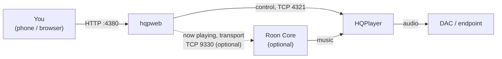

# hqpweb

**A web controller for HQPlayer.** Change filters, dither/modulator, volume, mode and
rate from any phone or browser, and see whether HQPlayer is keeping up.

**Status: alpha (0.1.0-alpha.1).** Works with HQPlayer Desktop 5; HQPlayer 6
Embedded is partly tested.

> Not affiliated with, endorsed by, or supported by Signalyst or Roon Labs.
> HQPlayer is a trademark of Signalyst and Roon is a trademark of Roon Labs LLC,
> used here only to identify compatible software.

## Why hqpweb?

Well, HQPlayer is one of the most cherished elements of my audio chain; I've loved
it for a long time. It does magic. But the interface leaves something to be
desired. I'm not an audio engineer, I'm a guy who likes usability, so I put a layer
on top. I hope it's useful, and I hope more people get into HQPlayer. If this makes
it easier, that's all I'm hoping for!

## How it fits



hqpweb never plays music itself. It talks to HQPlayer through HQPlayer's published
control protocol, and to Roon (if you want) through Roon's extension API.

## What it does

- **Quick changes:** 1x and Nx filters, dither or modulator, volume, presets.
- **Advanced:** mode, output rate, convolution, matrix profile, polarity, 20 kHz
  filter, adaptive volume.
- **Checked and reversible:** every change is read back from HQPlayer. If one stops
  playback or HQPlayer can't keep up, the app puts the old settings back, remembers
  the combination, and warns you next time. Undo is one tap.
- **Filter guide:** star ratings, what each filter favours, which ratios it can do,
  and modulator generations ([where these come from](#where-filter-descriptions-come-from)).
- **Processing:** whether HQPlayer is processing in real time.
- **Volume safety:** never raised by more than 6 dB at once; undo and rollback
  never raise it.
- **Roon (optional):** track, cover art, seek and working play/pause/skip for the
  Roon zone that feeds HQPlayer.

## Install

You need **git** and **Docker** (with Compose) on a machine that can reach HQPlayer on
TCP 4321.

```sh
git clone https://github.com/statelycurmudgeon/hqpweb.git
cd hqpweb
docker compose up -d --build
```

Open `http://<this machine's IP>:4380`, then **Settings → General → Add** your
HQPlayer's address (leave the name blank to use HQPlayer's own). On a phone, "Add to
Home Screen" makes it a full-screen app.

**Update:** read [CHANGELOG.md](CHANGELOG.md), then `git pull && docker compose up -d --build`.
Your instances and presets are kept.

## Options

Set these in a `.env` file next to `docker-compose.yml`, then `docker compose up -d`.

| Variable        | Default   | Use                                                                                                   |
| --------------- | --------- | ----------------------------------------------------------------------------------------------------- |
| `PORT`          | `4380`    | Port the app listens on.                                                                              |
| `BIND_ADDRESS`  | `0.0.0.0` | Interface to publish on, e.g. `127.0.0.1` behind a local proxy.                                       |
| `ALLOWED_HOSTS` | (none)    | Host names you open it by, comma-separated (IP addresses always work). Needed behind a reverse proxy. |

**Discovery** ("Scan now") uses multicast, so it needs host networking (Linux only)
and only sees the same network segment. Otherwise add instances by address. To turn
it on, create `docker-compose.override.yml`:

```yaml
services:
  controller:
    network_mode: host
    ports: !reset []
    # BIND_ADDRESS doesn't apply with host networking; limit it here instead:
    # environment: { HOST: 127.0.0.1 }
```

**Reverse proxy:** pass the `Host` header through, list the name in `ALLOWED_HOSTS`,
and don't buffer `/api/instances/*/events`.

## Roon (optional)

1. **Settings → Roon:** switch it on, then **Find** the core or enter its address
   (port 9330).
2. **In Roon → Settings → Extensions,** enable `hqpweb …`.
3. **Back in Settings → Roon,** pick the Roon zone that feeds each HQPlayer.

The container must reach the core on TCP 9330. Each install of hqpweb needs its own
approval in Roon.

## Security

There's **no login**: anyone who can reach the app can change HQPlayer, just as anyone
who can reach port 4321 already can. Keep it on a network you trust, or put an
authenticating proxy in front. Never expose it to the internet. To report a security problem, see [SECURITY.md](SECURITY.md).

## Tested with

| HQPlayer                        | Platform                | Status                                                                    |
| ------------------------------- | ----------------------- | ------------------------------------------------------------------------- |
| Desktop 5.17.2 (engine 5.35.10) | Linux (container, CUDA) | works (PCM)                                                               |
| Desktop 5.17.2 (engine 5.35.10) | Linux (VM)              | reads and Roon verified; changes not yet                                  |
| Desktop 5.17.2 (engine 5.35.10) | macOS (Apple Silicon)   | reads verified; changes tested on 5.15 (engine 5.32.5), SDM up to DSD1024 |
| Embedded 6 (engine 6.2.3)       | macOS (Apple Silicon)   | works: reads, changes and playback to a DAC over NAA                      |
| Embedded 6 (engine 6.2.3)       | Linux (container, CUDA) | works: reads, changes and playback to a DAC over NAA                      |
| Desktop 6, Windows              | —                       | **untested**: reports welcome ([TESTING.md](TESTING.md))                  |

hqpweb shows the _engine_ version (Settings → General); HQPlayer's own Help → About
shows the product version.

## Where filter descriptions come from

HQPlayer 6 describes its own filters and modulators to control apps, and hqpweb shows
that as-is. HQPlayer 5 doesn't, so for v5 hqpweb borrows HQPlayer 6's ratings and
focus for the same names (v5.17's lists match v6's). Ratio warnings on v5 follow the
v5 user manual's rules, corrected where we measured otherwise. The few filters and
modulators v6 dropped are described from the v5 manual, in our own words, without
ratings. Ratings are Signalyst's; nothing here is our own judgement of sound.

## Why can't I switch profiles or endpoints?

HQPlayer's control protocol doesn't offer it. hqpweb can list the configurations you
saved in HQPlayer, but loading one needs an encrypted handshake whose key only ships
in Signalyst's own Client, and nothing in the protocol selects the output device or
NAA. HQPlayer Embedded can switch profiles through its own web page, but Desktop has
no equivalent, and we'd rather keep one way of doing things for both than build and
maintain two. Signalyst has said profile switching over the control API is planned;
when it arrives, hqpweb will use it. Until then, use HQPlayer's Client (or Embedded's
web page) to change rooms, and hqpweb's presets for filters and dither.

## How this was made

I built hqpweb with an AI coding assistant (Claude, from Anthropic); I couldn't have
done it alone. HQPlayer's behaviour was measured on real instances
([docs/design-v1.md](docs/design-v1.md)), there are automated tests against a fake
HQPlayer, and the code has had security reviews. It will still have rough edges, and
I'd love your feedback: [TESTING.md](TESTING.md).

Development: [docs/development.md](docs/development.md).
