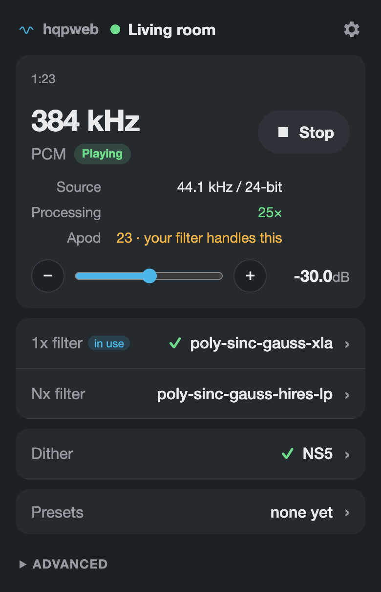
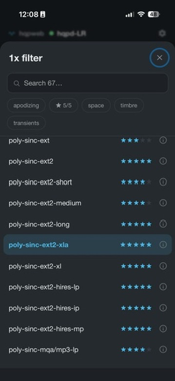
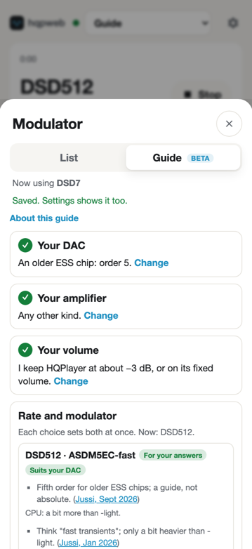
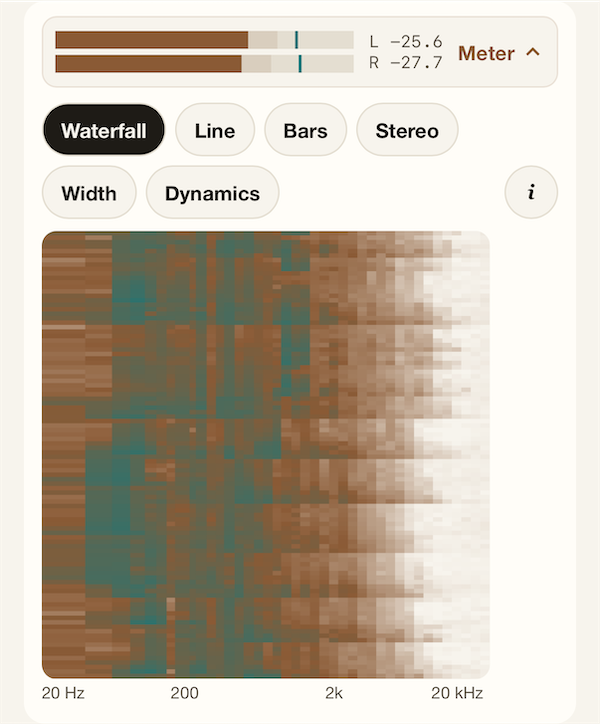
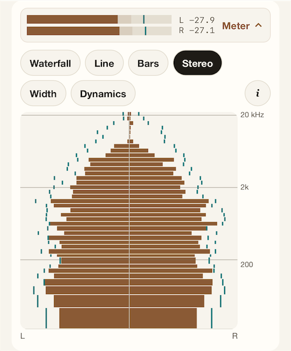
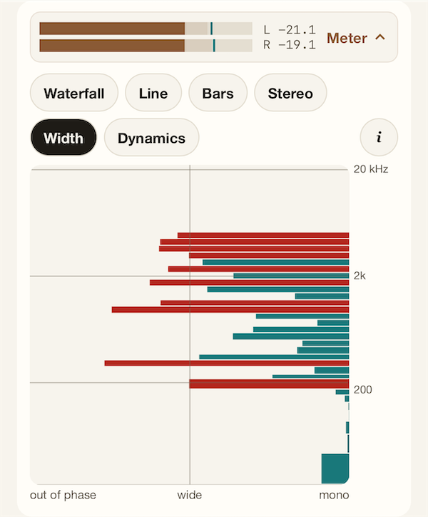
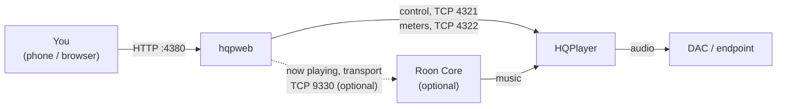

# hqpweb

**A web controller for HQPlayer.** Change filters, modulator or dither, rate and volume
from any phone or browser, see what HQPlayer is doing to the music, and get help
choosing, with every suggestion sourced.

**Status: beta (0.1.0-beta.5).** Works with HQPlayer Desktop 5 and HQPlayer 6
Embedded. Desktop 6 and Windows are untested.

> Not affiliated with, endorsed by, or supported by Signalyst or Roon Labs.
> HQPlayer is a trademark of Signalyst and Roon is a trademark of Roon Labs LLC,
> used here only to identify compatible software.

<p align="center">
  
  
  
</p>

## What it is

HQPlayer does the hard part: it upsamples, filters and modulates your music in
software before it reaches the DAC. hqpweb is a small app you run next to it, on any
machine on your network, and open in a browser. It changes HQPlayer's settings through
HQPlayer's own control protocol and shows you what HQPlayer reports back.

It isn't a music player or a library browser: Roon, HQPlayer's Client or your usual
app still plays the music. hqpweb is for the part of HQPlayer they leave behind.

## Who it's for

- **New to HQPlayer:** a guide asks about your DAC, amplifier, volume and connection,
  then suggests where to start, with the post each suggestion comes from. Every filter
  has a short note. If a change stops playback, hqpweb tries to put things back.
- **Long-time HQPlayer listeners:** the whole signal path on one card, a filter sheet
  you can narrow in two taps, Compare to hear two settings in turn, History of every
  change, and HQPlayer's own meters.
- **Roon households (optional):** track, cover art and transport for the Roon zone
  that feeds HQPlayer, on the same page.

## Why hqpweb?

Well, HQPlayer is one of the most cherished elements of my audio chain; I've loved
it for a long time. It does magic. But the interface leaves something to be
desired. I'm not an audio engineer, I'm a guy who likes usability, so I put a layer
on top. I hope it's useful, and I hope more people get into HQPlayer. If this makes
it easier, that's all I'm hoping for!

## What it does

**Change things, safely**

- **One card for the signal path:** source → filter → modulator or dither → rate, and
  whether HQPlayer is keeping up, with DSD and PCM as tabs. Volume, presets and the
  rarer switches (convolution, matrix profile, polarity, 20 kHz filter, adaptive
  volume) below. Two columns on a laptop, one on a phone; "Add to Home Screen" makes
  it a full-screen app.
- **Checked, with a safety net:** every change is read back from HQPlayer. If one stops
  playback or HQPlayer can't keep up, the app tries to put the old settings back,
  remembers the combination, and warns you next time. A rate and modulator that only
  work together (AHM below DSD1024) are offered as a pair. Undo is one tap.
- **Warns before silence:** if the next track can't start with your settings, the app
  says why and offers what would fit.
- **Volume safety:** never raised by more than 6 dB at once; undo and rollback never
  raise it. If HQPlayer restarts at a louder saved volume, the app can turn it down to a
  cap you set.
- **History and Compare:** every change, who made it (here or elsewhere) and whether it
  kept up; and two settings played in turn, so you can listen for the difference.

**Choose, with help**

- **A guide for the modulator and dither (beta):** a few questions, then where to start:
  rate and modulator together (for example DSD256 with ASDM7EC-fast, or DSD1024 with
  AHM), or the dither for your DAC, each linked to its source
  ([where the advice comes from](#where-the-guides-advice-comes-from)). It ends by
  handing over to the filters. A place to start, not the last word.
- **Filters with notes:** chips for what each filter favours, its phase, which ratios it
  can do and whether it's apodizing, and an (i) on each with a short, cited note
  ([where these come from](#where-filter-descriptions-come-from)).
- **Filters that fit here:** filters that can't play as set (a ratio they can't do, a
  failure on this machine, or trouble inferred from one) sit below the rest with the
  reason. Picking one asks first, and "What would it take?" suggests the nearest rate or
  modulator that would let it play. Load is only ever what this machine measured; you
  can turn the sort off, forget old results, or forget one.

**See what HQPlayer is doing**

- **Meters:** HQPlayer's own levels and spectrum, as a waterfall, line, bars, stereo
  (left and right back to back), width (how alike the channels are, band by band) and
  dynamics, delayed to line up with what you hear.
- **Live readouts:** processing speed (e.g. "keeping up 3.2×"), and the Apod and Clips
  counters when they're above zero, with a nudge toward an apodizing filter.

<p align="center">
  
  
  
</p>

**And**

- **Seek** within files HQPlayer plays itself.
- **Roon (optional):** track, cover art, seek and working play/pause/skip for the Roon
  zone that feeds HQPlayer. Off until you switch it on.
- **Classic layout:** the earlier one-column layout is still there (Settings →
  Appearance), without the newer parts (filter sort, guide flow, meters, Compare).

## How it fits



hqpweb never plays music itself. It talks to HQPlayer through HQPlayer's published
control protocol, and to Roon (if you want) through Roon's extension API.

## What it's built on

- **HQPlayer's control protocol:** XML over TCP 4321, as in Signalyst's MIT-licensed
  control SDK, the meter stream on the next port up (4322), and its discovery multicast.
  hqpweb uses nothing else of HQPlayer's: no files, no private APIs. What HQPlayer does with each command
  was measured on real instances ([docs/design-v1.md](docs/design-v1.md) §2).
- **Roon's extension protocol** (optional), written from Roon's Apache-2.0
  `node-roon-api` as a reference, without copying it.
- **A small Node.js server** (TypeScript, Node 24) with one runtime dependency, an XML
  parser. It holds the connection to each HQPlayer, checks every change, keeps your
  settings in one folder, and serves the app.
- **A Svelte web app** (Svelte 5, built with Vite): no account, no cloud, no
  trackers; nothing leaves your network unless you follow a source link.
- **One Docker image** for amd64 and arm64.
- **Tests:** unit tests (Vitest) and browser tests (Playwright) against fake HQPlayers
  built from read-only captures of real ones, plus a release check against a real
  HQPlayer before each release ([docs/release-checklist.md](docs/release-checklist.md)).
- **Licence:** MIT ([LICENSE](LICENSE)); third-party notices in
  [THIRD_PARTY_NOTICES.md](THIRD_PARTY_NOTICES.md).

## Install

You need **Docker** on a machine that can reach HQPlayer on TCP 4321 (amd64 or arm64:
a NAS, a Raspberry Pi 4/5, a home server). Save this as `docker-compose.yml` in a new
folder and run `docker compose up -d` there:

```yaml
name: hqpweb
services:
  controller:
    image: ghcr.io/statelycurmudgeon/hqpweb:latest
    container_name: hqpweb
    restart: unless-stopped
    init: true
    ports:
      - "4380:4380"
    volumes:
      - config:/config # your HQPlayers, presets and what hqpweb has learned
volumes:
  config:
```

Or in one line (Synology, Unraid, Portainer):

```sh
docker run -d --name hqpweb --restart unless-stopped --init \
  -p 4380:4380 -v hqpweb_config:/config \
  ghcr.io/statelycurmudgeon/hqpweb:latest
```

Then open `http://<that machine's address>:4380` and add your HQPlayer in **Settings →
HQPlayer**. On a phone, "Add to Home Screen" makes it a full-screen app.

**[docs/install.md](docs/install.md)** has the rest:

- updating, pinning a version and rolling back;
- where your settings live, and how to back them up;
- the ports it uses;
- options;
- discovery;
- reverse proxies (nginx, Caddy);
- running without Docker;
- what to check when something doesn't work.

## Roon (optional)

1. **Settings → Roon:** switch it on, then **Find** the core or enter its address
   (port 9330).
2. **In Roon → Settings → Extensions,** enable `hqpweb …`.
3. **Back in Settings → Roon,** pick the Roon zone that feeds each HQPlayer.

The container must reach the core on TCP 9330. Each install of hqpweb needs its own
approval in Roon.

## Security

There's **no login**: anyone who can reach the app can change HQPlayer, just as anyone
who can reach port 4321 already can. Keep it on a network you trust, or put an
authenticating proxy in front. Never expose it to the internet. To report a security problem, see [SECURITY.md](SECURITY.md).

## Tested with

| HQPlayer                        | Platform                | Status                                                            |
| ------------------------------- | ----------------------- | ----------------------------------------------------------------- |
| Desktop 5.17.2 (engine 5.35.10) | Linux (container, CUDA) | works (PCM)                                                       |
| Desktop 5.17.2 (engine 5.35.10) | Linux (VM)              | reads and Roon verified; changes not yet                          |
| Desktop 5.17.2 (engine 5.35.10) | macOS (Apple Silicon)   | works: changes and playback verified (PCM, and SDM up to DSD1024) |
| Embedded 6.1 (engine 6.2.5)     | macOS (Apple Silicon)   | works: playback to a DAC over NAA (changes verified on 6.2.3)     |
| Embedded 6 (engine 6.2.3)       | Linux (container, CUDA) | works: reads, changes and playback to a DAC over NAA              |
| Desktop 6, Windows              | —                       | **untested**: reports welcome ([TESTING.md](TESTING.md))          |

hqpweb shows the _engine_ version (Settings → HQPlayer); HQPlayer's own Help → About
shows the product version.

## Where filter descriptions come from

The (i) notes paraphrase HQPlayer 6's built-in help, the HQPlayer 6.1.1 manual (§4.6)
and Signalyst's developer's forum posts, each line cited, posts dated and older ones
marked "possibly dated". Paraphrased, never copied: the manual's licence doesn't allow
copying.

HQPlayer 6 describes its own filters and modulators to control apps, and hqpweb shows
that as-is. HQPlayer 5 doesn't, so for v5 hqpweb borrows HQPlayer 6's ratings and
focus for the same names (v5.17's lists match v6's). Ratio warnings on v5 follow the
v5 user manual's rules, corrected where we measured otherwise. Which filters are
apodizing comes from HQPlayer 6's own filter table. The few filters and modulators v6
dropped are described from the v5 manual, in our own words, without ratings. Ratings
are Signalyst's; nothing here is our own judgement of sound.

## Where the guide's advice comes from

From what Signalyst's developer has written in public, mostly his 2025–26 posts on the
Roon forum, and from the HQPlayer manual (paraphrased, never copied). Each suggestion
links the post it comes from, with its date, because the advice changes as HQPlayer
does. The rules are kept as data in one file
([policy.ts](apps/web/src/lib/advice/policy.ts)), so a correction is a small edit;
please [open an issue](https://github.com/statelycurmudgeon/hqpweb/issues) if one is
out of date. Modulator names always come from your HQPlayer's own list.

## Why can't I switch profiles or endpoints?

HQPlayer's control protocol doesn't let other apps do it. Loading a saved
configuration needs an encrypted handshake whose key only ships in Signalyst's own
Client, and nothing in the protocol selects the output device or NAA. HQPlayer
Embedded can switch profiles on its own web page, but that restarts its engine (and
resets the volume), and Desktop has nothing like it. So use HQPlayer's Client, or
Embedded's web page, to change rooms, and hqpweb's presets for filters and dither.

## How this was made

I built hqpweb with an AI coding assistant (Claude, from Anthropic); I couldn't have
done it alone. HQPlayer's behaviour was measured on real instances
([docs/design-v1.md](docs/design-v1.md)), there are automated tests against a fake
HQPlayer, and the code has had security reviews. It will still have rough edges, and
I'd love your feedback: [TESTING.md](TESTING.md).

Development: [docs/development.md](docs/development.md).
